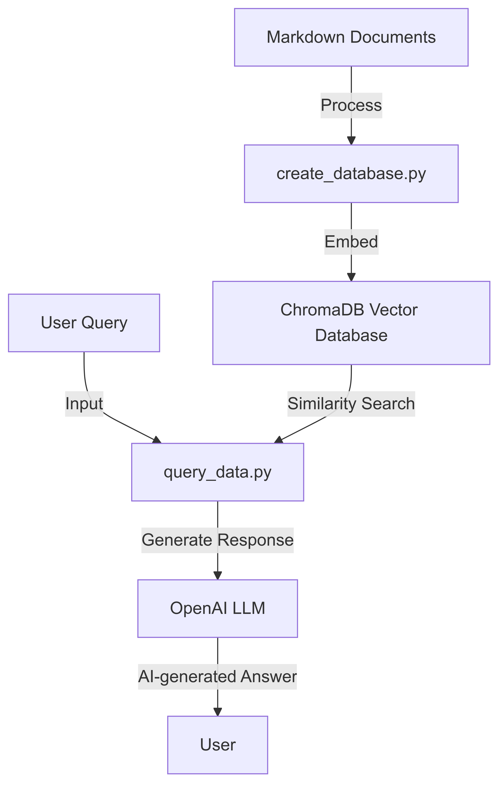

# RAG-based VectorDB-LLM Query Engine

This project implements an AI-powered document query system using LangChain, ChromaDB, and OpenAI's language models. It enables users to create a searchable database from markdown documents and query it using natural language.

## Features

- Vector database creation from markdown documents
- Embedding and query cost estimation
- Similarity searches on the database
- AI-powered response generation for user queries

## Architecture Diagram

</img>

## Requirements

- Python 3.7+
- Dependencies listed in `requirements.txt`

## Installation

1. Clone this repository
2. Create a virtual environment:
   ```
   python -m venv .venv
   source .venv/bin/activate  # On Windows, use `.venv\Scripts\activate`
   ```
3. Install required packages:
   ```
   pip install -r requirements.txt
   ```
4. Set up your OpenAI API key in a `.env` file:
   ```
   OPENAI_API_KEY=your_api_key_here
   ```

## Getting Started

Follow these steps to quickly set up and use the RAG-based VectorDB-LLM Query Engine:

1. Create a database from your markdown documents:
    ```
    python create_database.py --data_folder data/go-docs --chroma_db_path chroma_go_docs/
    ```
    This command will process the markdown files in the data/go-docs directory and create a vector database in the chroma_go_docs/ folder.

2. Query the database with a natural language question:

    ```
    python query_data.py --query_text "Explain goroutines in go in a sentence" --chroma_db_path chroma_go_docs/ --prompt_model gpt-3.5-turbo
    ```

3. View the AI-generated response:
    ```
    Goroutines are lightweight, concurrent functions or methods in Go that run independently, managed by the Go runtime, allowing for efficient parallel execution and easy implementation of concurrent programming patterns.
    ```

## Usage

For more detailed usage instructions, refer to the following sections:

1. Create the Database
    ```
    python create_database.py --data_folder path/to/your/markdown/files --chroma_db_path path/to/save/database
    ```

2. Query the Database
    ```
    python query_data.py --query_text "Your question here" --chroma_db_path path/to/database --prompt_model gpt-3.5-turbo
    ```

## File Structure

- `create_database.py`: Database creation script
- `query_data.py`: Database querying script
- `estimate_cost.py`: Cost estimation module
- `get_token_count.py`: Token counting utility
- `data/`: Markdown documents directory
- `chroma/`: ChromaDB database storage (gitignored)

## Notes

- Uses OpenAI's `text-embedding-3-small` for embeddings and `gpt-3.5-turbo` for responses by default
- Place markdown files in `data/` or specify a custom path
- ChromaDB database stored in `chroma/` (gitignored)

## Troubleshooting

- Ensure compatible Python version and correct package installation
- Verify OpenAI API key and account credits for API errors

## License

This project is licensed under the terms of the MIT License. For more information, please refer to the [LICENSE](LICENSE) file.

## Built with

- [LangChain](https://github.com/hwchase17/langchain)
- [ChromaDB](https://github.com/chroma-core/chroma)
- [OpenAI](https://platform.openai.com/docs)
- [tiktoken](https://github.com/openai/tiktoken)

For questions or issues, please open an issue on the GitHub repository.